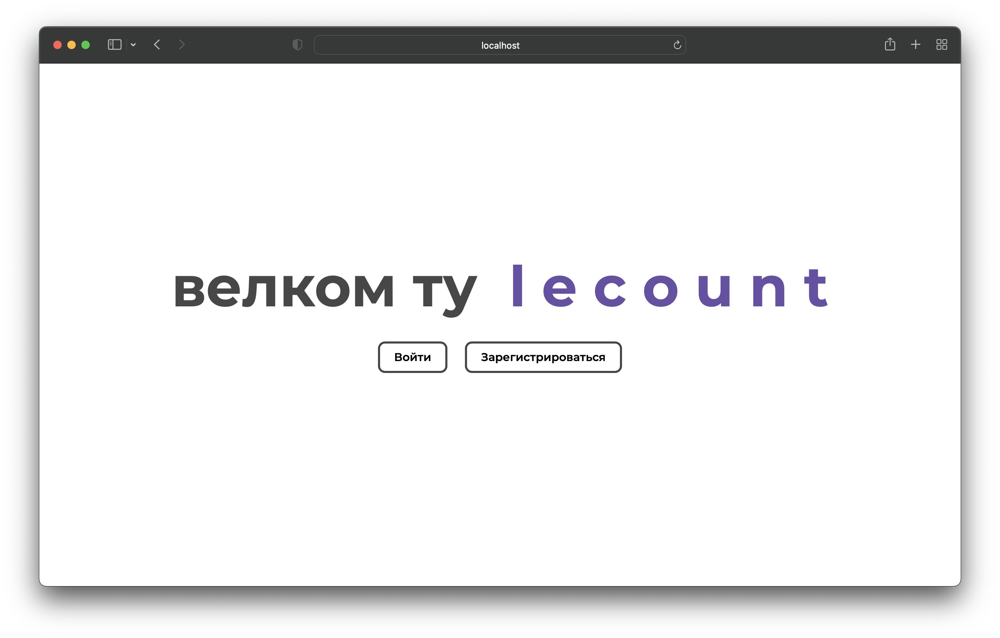
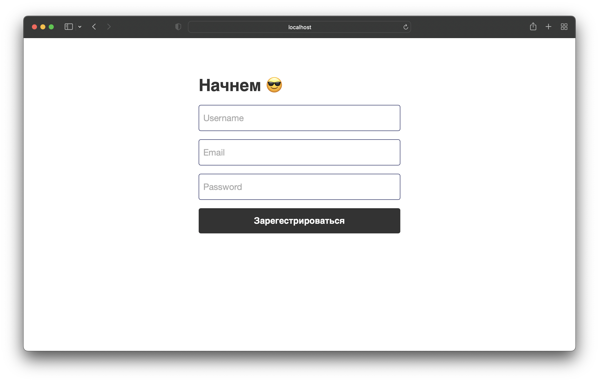
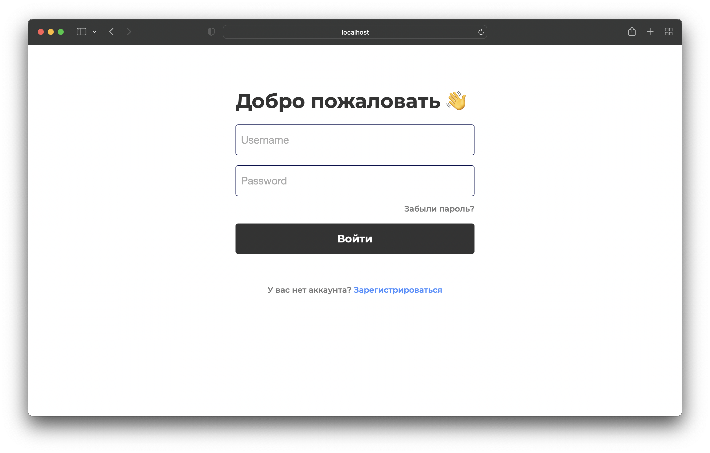
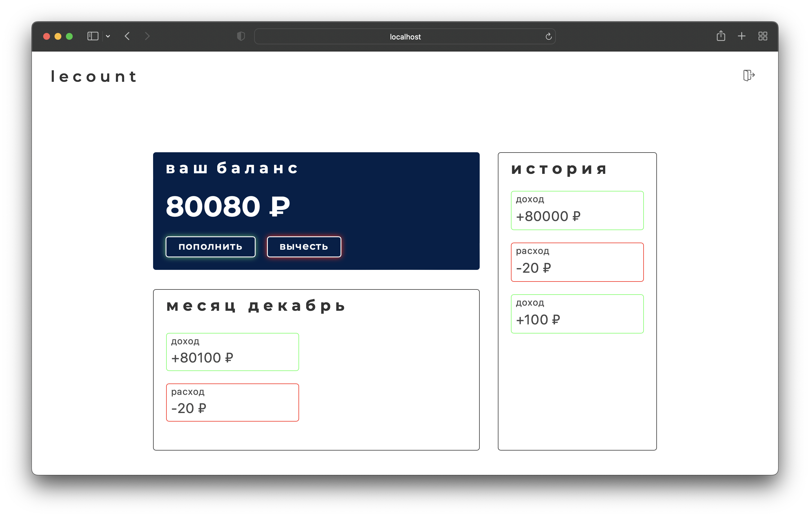

# lecount - accounting for expenses and expenses

Welcome to the spending and expense tracking app! This web application is designed to help you track your finances, plan your budget and manage your expenses.

# Technologies
1) Frontend: HTML, CSS, Thymeleaf
2) Backend: Java
3) BD: PostgreSQL

# Hello page

# Registration

# Authentication

# Home page

# Plans

In the future I plan to improve my site by adding jwt key and react.js to my application. There will also be a section for viewing infographics by webapp